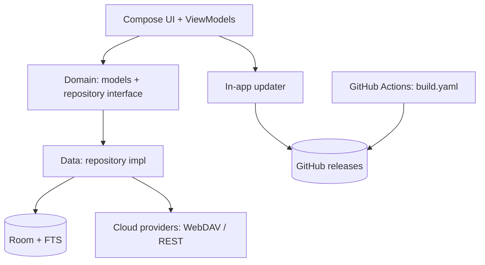

<div align="center">

# ZIM

Fast, local-first notes for Android — Material 3 Expressive, offline by default.

[](https://github.com/MoHamed-B-M/ZIM/blob/main/LICENSE)
[](https://github.com/MoHamed-B-M/ZIM/actions)
[](https://github.com/MoHamed-B-M/ZIM/stargazers)

</div>

## What is this?

ZIM is a lightweight Android notes app with checklists, tags, pin/archive/trash, and instant full-text search — all stored on-device in Room. Cloud sync (WebDAV / REST) is an opt-in plugin, and the app updates itself from GitHub releases. No account, no tracking.

## Download

Grab the latest beta APK from the [beta-latest prerelease](https://github.com/MoHamed-B-M/ZIM/releases/tag/beta-latest), or browse all [releases](https://github.com/MoHamed-B-M/ZIM/releases). On first install allow “Install unknown apps” when prompted.

## Scripts

Requires JDK 21 and the Android SDK (compileSdk 37).

| Command | Description |
|---------|-------------|
| `./gradlew :app:installDebug` | Install the debug build on a connected device |
| `./gradlew :app:assembleDebug` | Build a debug APK |
| `./gradlew :app:assembleRelease` | Build a signed release APK (uses `KEYSTORE_*` env vars when set) |

## Tech Stack

| Technology | Version |
|------------|---------|
| Kotlin | 2.3.20 |
| Jetpack Compose (BOM) | 2026.08.00 |
| Material 3 Expressive | 1.5.0-alpha26 |
| Room + FTS search | 2.8.3 |
| Koin | 4.1.1 |
| Navigation Compose | 2.9.7 |
| WorkManager / DataStore / OkHttp | standard AndroidX |
| AGP / compileSdk / minSdk | 9.3.2 / 37 / 26 |

## Features

- Notes, checklists, tags, pins, archive, trash (30-day auto-purge)
- Instant local search with match highlighting (Room FTS)
- 3 switchable launcher icons (Settings → App icon)
- In-app updater: Stable channel (releases) and Beta channel (`beta-latest` prerelease), download + install inside the app
- Opt-in cloud sync: WebDAV / Nextcloud or custom REST, last-write-wins with conflict surfacing
- JSON export / import
- Expressive UI: floating bottom bar + scalloped FAB dock, spring animations, dynamic color

## Project Structure

```
.github/
  workflows/
app/
  src/
    main/
      java/
      res/
gradle/
LICENSE
README.md
build.gradle.kts
gradle.properties
gradlew
gradlew.bat
settings.gradle.kts
```

Key sources under `app/src/main/java/com/zimapp/zim/`:

```
data/
  local/         Room database, DAO, FTS entities
  remote/        CloudSyncProvider + WebDAV / REST implementations
  repository/    NoteRepositoryImpl
  update/        In-app updater (GitHub releases API, DownloadManager)
  work/          Opt-in background sync worker
di/              Koin modules
domain/
  model/         Note
  repository/    NoteRepository interface
ui/
  navigation/    Floating bottom bar + FAB dock
  notes_list/    Notes grid, search, swipe actions
  note_detail/   Editor with Markdown preview
  todo/          Checklist aggregator
  settings/      Grouped settings, icon picker, updater, cloud config
  theme/         Expressive theme, color, shape
```

## Architecture



## Documentation

| Resource | Description |
|----------|-------------|
| [.github/workflows/build.yaml](.github/workflows/build.yaml) | CI: versioning, signing, beta `beta-latest` prerelease and stable releases |
| [gradle/libs.versions.toml](gradle/libs.versions.toml) | Single source of truth for dependency versions |
| [app/src/main/AndroidManifest.xml](app/src/main/AndroidManifest.xml) | Permissions, launcher icon aliases, FileProvider |

## Contributing

Issues and pull requests are welcome — please target the `beta` branch. Beta builds publish automatically as a rolling prerelease.

<a href="https://github.com/MoHamed-B-M/ZIM/graphs/contributors">
  
</a>

## License

GPL-3.0 — see [LICENSE](LICENSE).

---

<div align="center">

[](https://star-history.com/#MoHamed-B-M/ZIM&Date)

</div>
