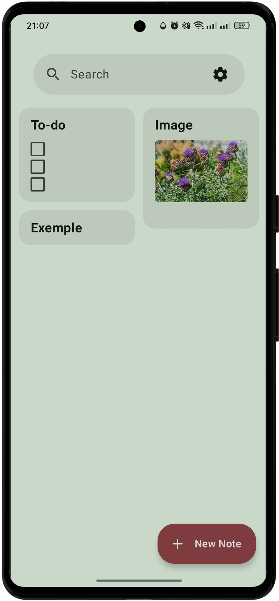
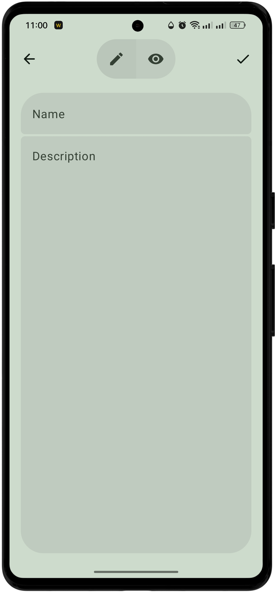
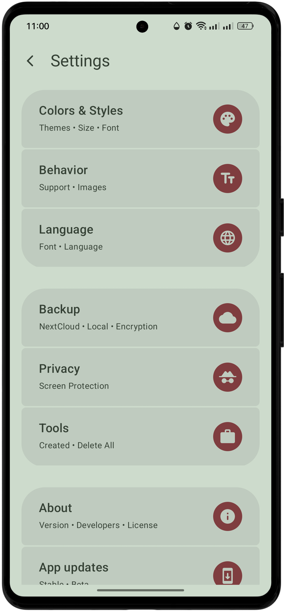
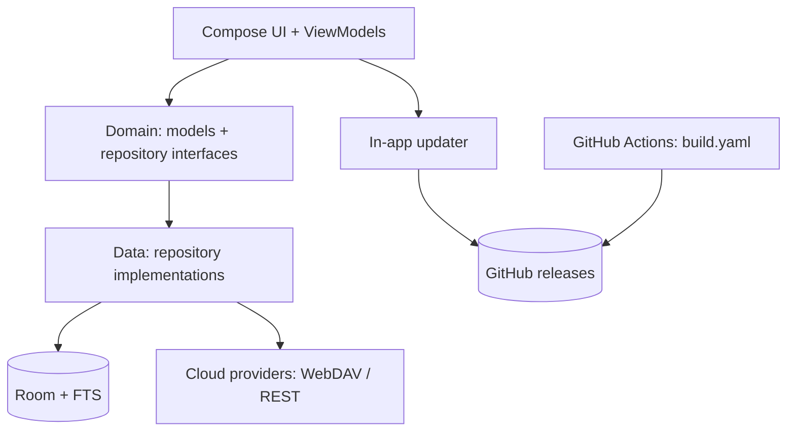

<div align="center">

# ZIM

**Fast, local-first notes for Android — Material 3 Expressive, offline by default.**


<br>
<em>Midnight (default) — switchable to Paper Ring or Stack in Settings → App icon</em>

[](https://github.com/MoHamed-B-M/ZIM/blob/main/LICENSE)
[](https://github.com/MoHamed-B-M/ZIM/actions)
[](https://github.com/MoHamed-B-M/ZIM/releases)
[](https://github.com/MoHamed-B-M/ZIM/stargazers)
<br>
<a href="https://rookieenough.github.io/Orion-Data/redirect.html?id=zim"></a>

  

</div>

---

## What is ZIM?

ZIM is a lightweight, privacy-focused Android notes app built with **Material 3 Expressive** and **Jetpack Compose**. All data is stored locally on-device using **Room** with **Full-Text Search (FTS)**. Cloud sync (WebDAV/Nextcloud or custom REST) is entirely opt-in. The app updates itself directly from GitHub releases — no Play Store required. No account, no tracking, no telemetry.

---

## Download

| Channel | Link | Notes |
|---------|------|-------|
| **Beta (rolling)** | [`beta-latest` prerelease](https://github.com/MoHamed-B-M/ZIM/releases/tag/beta-latest) | Auto-updates from GitHub Actions on every `beta` branch push |
| **Stable** | [Latest release](https://github.com/MoHamed-B-M/ZIM/releases/latest) | Tagged releases (`v1.0.0`, `v1.1.0`, …) |

> **First install:** Allow "Install unknown apps" when prompted. The in-app updater will handle future updates.

---

## Features

### Core Notes
- **Rich notes** — plain text, checklists, tags, pins
- **Organization** — archive, trash (30-day auto-purge), instant full-text search with match highlighting (Room FTS)
- **Markdown** — full rendering with images, links, quotes, tables, and live preview
- **Drag & drop** — images and files directly into notes from floating windows
- **Rich text editor** — formatting toolbar, undo/redo, find, HTML format column

### Expressive UI (Material 3 Expressive)
- Floating bottom bar + scalloped FAB dock with spring animations
- Dynamic color theming (Material You) with custom seed colors
- Adjustable font size, corner radius, and monospace font option
- **Material 3 Expressive pull-to-refresh** with expressive loading indicator
- 3 switchable launcher icons (Midnight, Paper ring, Stack) — Settings → App icon

### Privacy & Security
- **App lock** — passcode, pattern, or fingerprint + screen protection (FLAG_SECURE)
- **Encrypted backups** — password-protected local backups + plain JSON export/import
- **Local-first** — no network calls unless you enable cloud sync

### Cloud Sync (Opt-in)
- WebDAV / Nextcloud or custom REST endpoint
- Last-write-wins with conflict surfacing
- Background worker with configurable intervals

### In-App Updater
- **Stable channel** — GitHub releases (`vX.Y.Z` tags)
- **Beta channel** — rolling `beta-latest` prerelease from `beta` branch
- Download + install inside the app, signature verification
- Contained loading indicator during check/download
- APK auto-cleanup after install

### Widgets & Extras
- Home screen widgets: latest note + quick-add button (Glance)
- Per-app language picker (20+ languages)
- First-run walkthrough covering updates & "Install unknown apps" permission
- Terms of Service acceptance flow

---

## Tech Stack

| Technology | Version |
|------------|---------|
| **Kotlin** | 2.2.0 |
| **AGP** | 8.12.0-rc01 |
| **compileSdk / targetSdk / minSdk** | 36 / 36 / 26 |
| **Jetpack Compose (BOM)** | 1.8.3 |
| **Material 3** | 1.5.0-alpha13 |
| **Material 3 Expressive** | 1.5.0-alpha13 |
| **Room + FTS** | 2.7.2 |
| **KSP** | 2.2.0-2.0.2 |
| **Hilt (DI)** | 2.57 |
| **Navigation Compose** | 2.9.2 |
| **DataStore Preferences** | 1.1.7 |
| **Glance (Widgets)** | 1.1.0 |
| **Coil (Image loading)** | 2.7.0 |
| **OkHttp (Updater)** | 4.12.0 |
| **m3color (Dynamic color)** | 2024.6 |

> Dependency versions are centralized in [`gradle/libs.versions.toml`](gradle/libs.versions.toml).

---

## Requirements

- **JDK 21** (for building)
- **Android SDK** with compileSdk 36
- **Android 8.0+ (API 26)** on device

---

## Building

```bash
# Debug build & install
./gradlew :app:installDebug

# Debug APK
./gradlew :app:assembleDebug

# Signed release APK (requires KEYSTORE_* env vars)
./gradlew :app:assembleRelease
```

**CI signs releases automatically** using `KEYSTORE_PATH`, `KEYSTORE_PASSWORD`, `KEY_ALIAS`, `KEY_PASSWORD` — see [`.github/workflows/build.yaml`](.github/workflows/build.yaml).

---

## Project Structure

```
.github/
  workflows/
    build.yaml           # CI: versioning, signing, beta-latest prerelease, stable releases
app/
  src/
    main/
      java/com/zimapp/zim/
        data/
          local/         # Room database, DAO, FTS entities
          remote/        # CloudSyncProvider + WebDAV / REST implementations
          repository/    # NoteRepositoryImpl
          update/        # In-app updater (GitHub releases API, DownloadManager)
          work/          # Opt-in background sync worker
        di/              # Koin modules
        domain/
          model/         # Note, Settings
          repository/    # Repository interfaces
          usecase/       # NoteUseCase, SettingsUseCase, ImportExportUseCase
        presentation/
          components/    # Reusable UI (MaterialScaffold, Markdown, Animations, etc.)
          navigation/    # Floating bottom bar + FAB dock, animated transitions
          screens/
            home/        # Notes grid, search, swipe actions, pull-to-refresh
            edit/        # Editor with Markdown preview, rich text toolbar
            settings/    # Grouped settings, icon picker, updater, cloud config, lock
            onboarding/  # First-run walkthrough, permissions
            terms/       # Terms of Service
          theme/         # Expressive theme, color schemes, shapes, typography
          widgets/       # Glance widgets (latest note, quick-add)
        widget/          # App widget receivers
      res/               # Resources (drawables, values, mipmaps, xml)
gradle/
  libs.versions.toml     # Single source of truth for all dependency versions
LICENSE                  # GPL-3.0
README.md
build.gradle.kts
gradle.properties
gradlew / gradlew.bat
settings.gradle.kts
```

---

## Architecture



- **Clean Architecture** — UI → Domain → Data
- **Unidirectional data flow** — State hoisted in ViewModels
- **Hilt** for dependency injection (App, ViewModels, Workers)
- **Koin** for lightweight service locator (settings, cloud providers)
- **Coroutines + Flow** for async/reactive streams

---

## Documentation

| Resource | Description |
|----------|-------------|
| [`.github/workflows/build.yaml`](.github/workflows/build.yaml) | CI pipeline: version stamping, signing, beta/stable release automation |
| [`gradle/libs.versions.toml`](gradle/libs.versions.toml) | Centralized dependency versions (plugins + libraries) |
| [`app/src/main/AndroidManifest.xml`](app/src/main/AndroidManifest.xml) | Permissions, launcher icon aliases (`MainActivityIcon2/3`), FileProvider |
| [`changelogs.md`](changelogs.md) | In-app "What's new" source — top section read by updater |
| [`CHANGELOG.md`](CHANGELOG.md) | Full release history (Keep a Changelog format) |

---

## Contributing

1. **Target the `beta` branch** — beta builds publish automatically as a rolling prerelease
2. **Conventional commits** — `feat:`, `fix:`, `perf:`, `refactor:`, `chore:`, `docs:`
3. **Open an issue first** for significant changes
4. **Run `./gradlew :app:assembleDebug`** before submitting

<a href="https://github.com/MoHamed-B-M/ZIM/graphs/contributors">
  
</a>

---

## License

**GPL-3.0** — see [LICENSE](LICENSE).

Based on [EasyNotes](https://github.com/Kin69/EasyNotes) by Kin69 (GPL-3.0).

---

<div align="center">

[](https://star-history.com/#MoHamed-B-M/ZIM&Date)

</div>